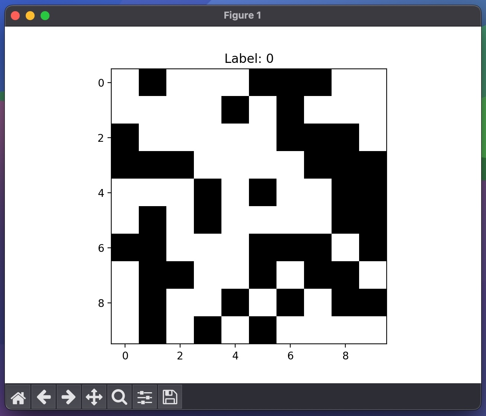

# Zero-Knowledge Proof for Nuclear Disarmament Verification

## Introduction
In the realm of nuclear disarmament, verifying the dismantling of nuclear warheads is a complex challenge, marred by the paradox of needing to confirm the authenticity of warheads without revealing sensitive design information. This project is inspired by the innovative approach presented by Boaz Barak, which utilizes Zero Knowledge Proofs (ZKPs) in cryptography to address this challenge.

The traditional methods rely on 'information barriers' which are susceptible to tampering and do not fully prevent the leakage of sensitive data. Our solution leverages ZKPs to verify the authenticity of nuclear warheads in a manner that is both secure and devoid of information leakage, thus enhancing trust among nations while preserving national security interests.

## Problem Background
The task at hand is to ensure that nations adhere to disarmament treaties by dismantling actual nuclear warheads and not dummies. Traditional verification methods involve measurements that, albeit innocuous, could leak crucial design details. The need is for a method that confirms authenticity without revealing any sensitive information - a perfect scenario for the application of ZKPs.

## Our Approach
We propose a novel verification system using Zero Knowledge Machine Learning (zkML). This approach involves:
1. Generating a predictive model that can verify the authenticity of a nuclear warhead based on neutron detection patterns.
2. Utilizing Zero Knowledge Proofs to ensure that the verification process reveals no information about the warhead's design.

The model is trained on synthetic data representing neutron detection patterns and then converted to a format compatible with zkML using [ezkl](https://ezkl.xyz), a library for zero-knowledge proofs.

## Tools and Technologies
- **PyTorch**: For building and training the neural network model.
- **ONNX**: For exporting the PyTorch model to a standardized format.
- **ezkl**: For integrating Zero Knowledge Proof functionality with the ONNX model.
- **NumPy**: For data manipulation and generation of synthetic datasets.

## Repository Structure
- `data_generation.py`: Script for generating synthetic data representing neutron patterns.
Below is a sample synthetic data created to simulate the neutron detection phase.

- `train_model.py`: Defines and trains the Neutron Detector CNN model.
- `export_onnx.py`: Exports the trained model to the ONNX format.
- `ezkl_integration.py`: Integrates the ONNX model with ezkl for generating and verifying zero-knowledge proofs.

## How to Run
1. **Generate Synthetic Data**: Run `data_generation.py` to create a dataset.

2. **Train the Model**: Execute `train_model.py` to train the Neutron Detector CNN.
3. **Export to ONNX**: Use `export_onnx.py` to convert the trained model to ONNX format.
4. **Zero-Knowledge Proof Generation and Verification**: Run `ezkl_integration.py` to generate and verify ZKPs.

Demo of running the ezkl integration script:

## Conclusion and Future Work
This project represents a groundbreaking application of theoretical cryptographic constructs in the physical world. While it focuses on the cryptographic and machine learning aspects, it forms a crucial component of a larger process in nuclear disarmament verification. Future directions could include scaling the model for more complex scenarios and integrating it with real-world neutron detection data.

---

*Note: This work is based on unclassified information and is intended for academic and peaceful purposes only.*
